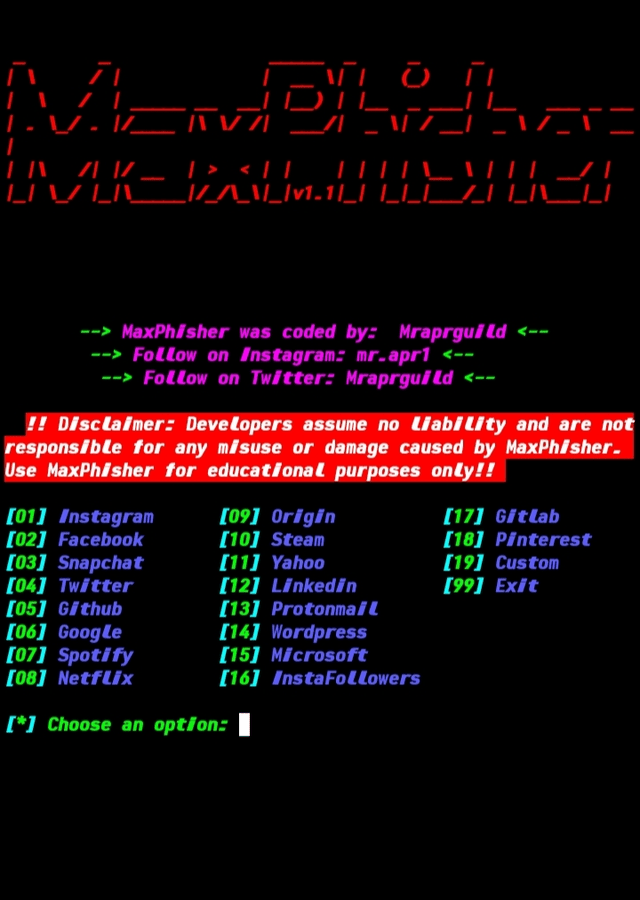

# MaxPhisher

MaxPhisher is a phishing tool available for Termux users.

## [+] Installation and Usage
* $ apt update
* $ apt upgrade
* $ pkg install git
* $ git clone https://github.com/Mraprguild/MaxPhisher
* $ cd MaxPhisher
* $ bash MaxPhisher.sh

## Connect to us today

<a href="https://www.instagram.com/mr.apr1" target="_blank">

